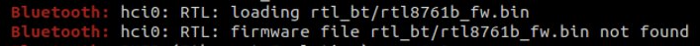

### How to install unsupported Bluetooth 5.0 Dongle on Linux
These will be the steps to install the dongle successfully in Linux, in this case, Debian-based Linux.
To check the problem I use the “dmesg” command to have more insight information about the error.
```bash
sudo dmesg | grep Bluetooth
```
You will see something like this… that means that we need to install the firmware for this chipset because the file is not there.



1. Uncompressed the downloaded file
2. Navigate where the driver file is, in my case was in 20201202_LINUX_BT_DRIVER/rtkbt-firmware/lib/firmware/rtlbt
3. Now we must copy the firmware files to the /usr/lib/firmware/rtl_bt and rename it .bin extension, for this we need sudo for permissions. There are two files we need: rtl8761b_config and rtl8761b_fw
```bash
sudo cp rtl8761b_config /usr/lib/firmware/rtl_bt/rtl8761b_config.bin
sudo cp rtl8761b_fw /usr/lib/firmware/rtl_bt/rtl8761b_fw.bin
```
4. After copying the files, we need to unplug the USB dongle again or reboot your pc and check the “dmesg” command again, if everything goes well the missing file error “not found” will not be present anymore.
5. That’s it … Enjoy your Bluetooth 5.0 connection :)
   Note: if your Linux OS upgrades the firmware in the future, you will need to repeat this steps again to have the device drivers installed after upgrading, so I recommend to read well if an upgrade to the system will also upgrades the firmware, if for any reason your Bluetooth dongle stops working… you know what to do again.